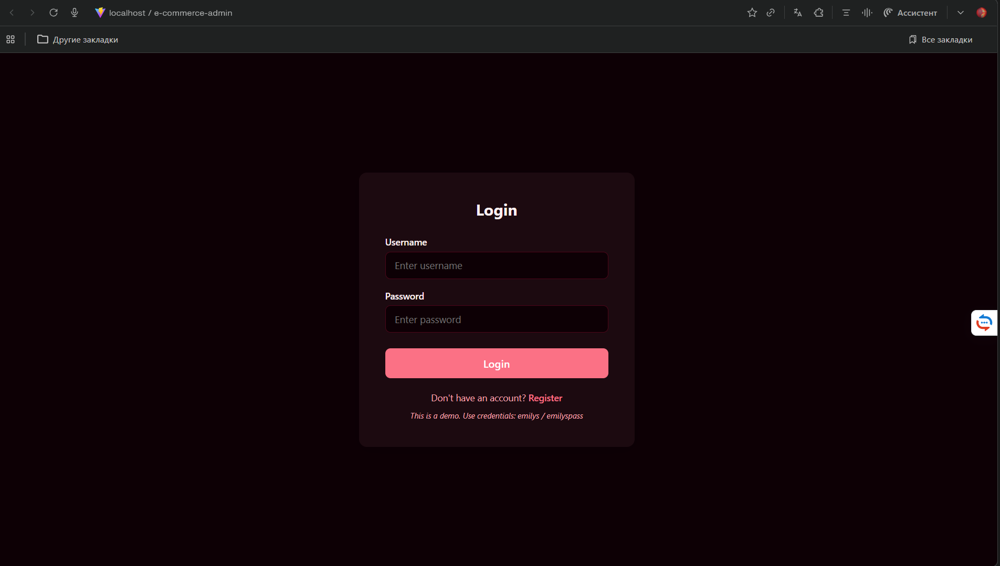
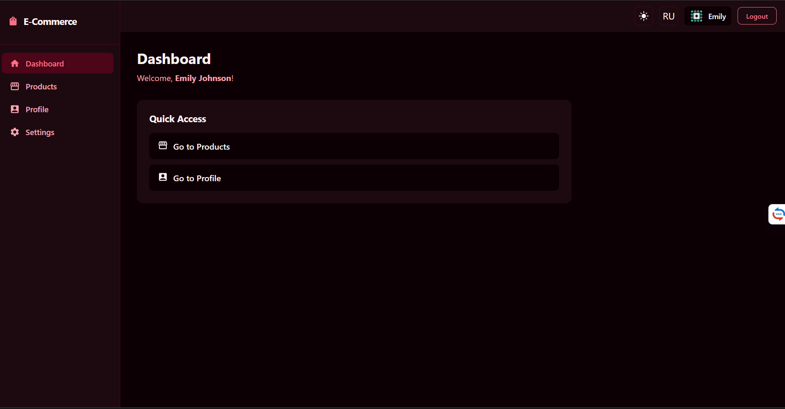
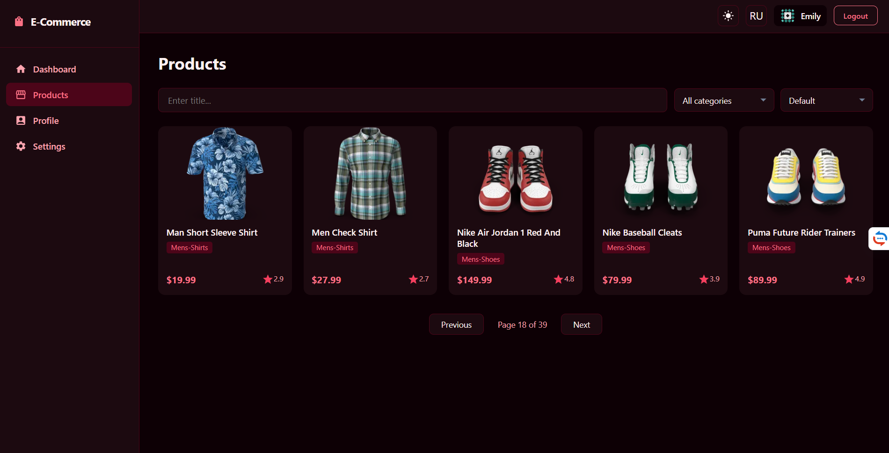
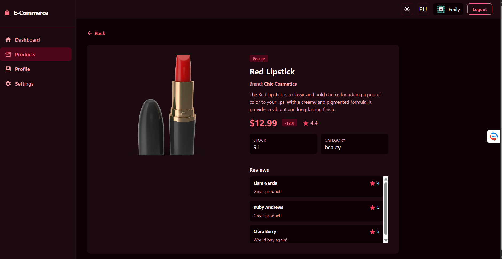
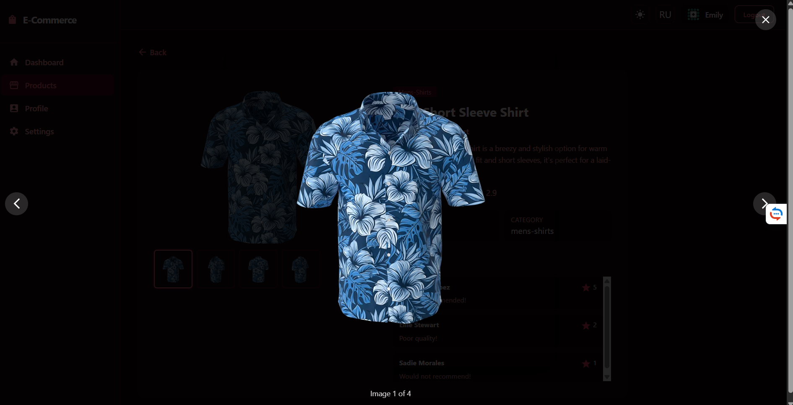
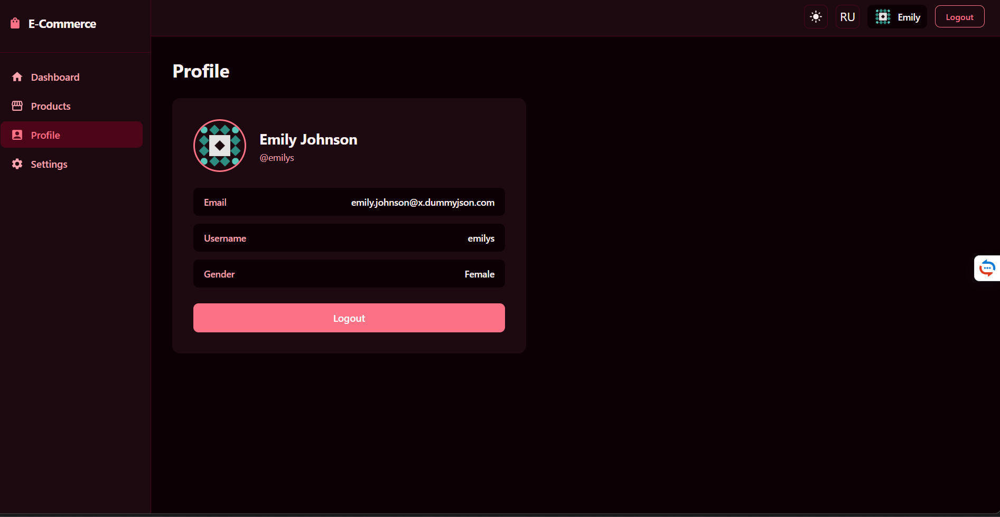
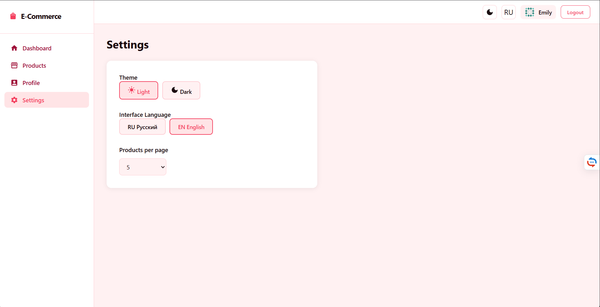
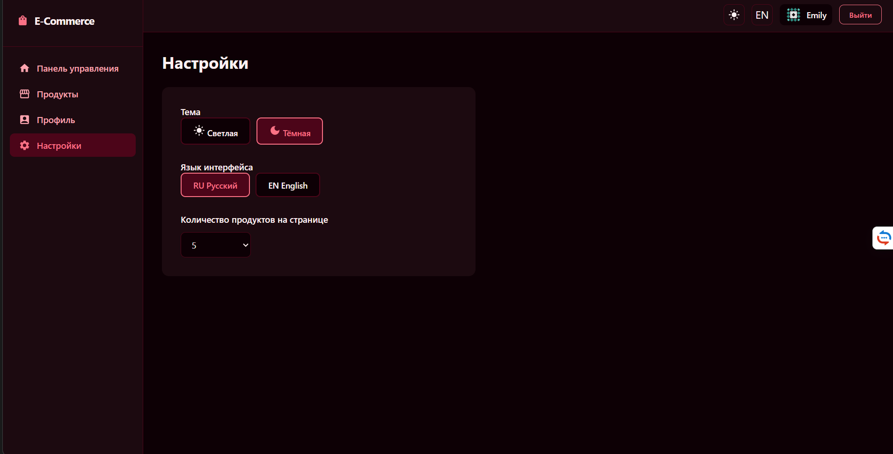
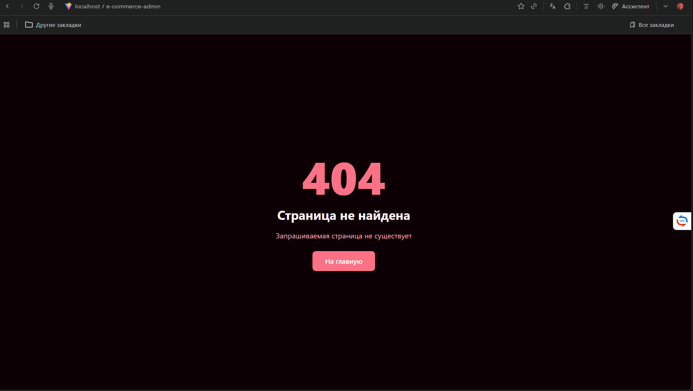
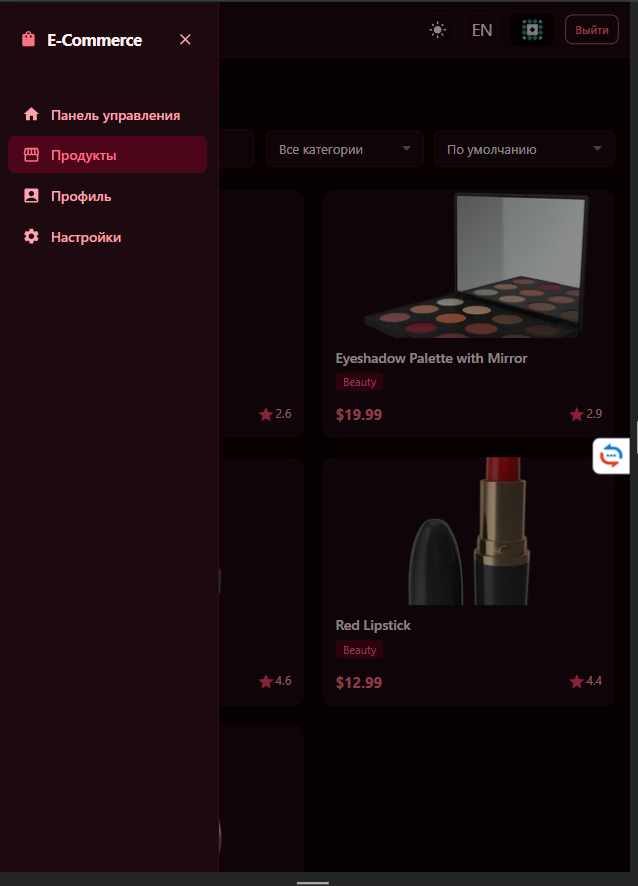

# E-commerce Admin

SPA административная панель для e-commerce системы, реализованная в рамках HW_3.

**ФИО:** Дедов Иван

---

## Содержание

- [Технологический стек](#технологический-стек)
- [Запуск проекта](#запуск-проекта)
- [Архитектура](#архитектура)
- [Реализованные требования](#реализованные-требования)
- [Дополнительные улучшения](#дополнительные-улучшения)
- [Скриншоты](#скриншоты)

---

## Технологический стек

| Категория           | Технология                              |
| ------------------- | --------------------------------------- |
| UI                  | React 19, TypeScript                    |
| Стейт-менеджмент    | Redux Toolkit, RTK Query                |
| Маршрутизация       | React Router v7                         |
| Интернационализация | i18next, react-i18next                  |
| UI-компоненты       | MUI (Material UI) v7, MUI Icons         |
| Анимации            | Framer Motion                           |
| Сборка              | Vite                                    |
| Тесты               | Vitest, @testing-library/react          |
| Линтер / Форматтер  | ESLint (flat config), Prettier          |
| Git-хуки            | Husky, lint-staged                      |
| API                 | [DummyJSON](https://dummyjson.com/docs) |

---

## Запуск проекта

**Требования:** Node.js >= 20

```bash
# Установка зависимостей
npm install

# Запуск в режиме разработки
npm run dev

# Сборка для продакшена
npm run build

# Предпросмотр сборки
npm run preview
```

**Запуск тестов:**

```bash
# Запуск тестов
npm run test

# Запуск тестов с покрытием
npm run test:coverage
```

**Линтинг и форматирование:**

```bash
npm run lint
npm run lint:fix
npm run format
npm run format:check
```

**Тестовый аккаунт (DummyJSON):**

```md
Логин: emilys
Пароль: emilyspass
```

Есть правда и другие варианты, можно посмотреть в документации dummy.json

---

## Архитектура

Проект построен по принципу **Feature Sliced Design (FSD)** - feature-based архитектурный подход с явным разделением слоёв:

```md
src/
├── app/ # Инициализация приложения
│ ├── providers/ # AuthInit, ErrorBoundary, ThemeProvider
│ ├── router/ # AppRouter, ProtectedRoute, PublicRoute, LogoutRoute
│ └── store/ # Redux store, typed hooks
│
├── pages/ # Страницы приложения (lazy-loaded)
│ ├── DashboardPage/
│ ├── LoginPage/
│ ├── RegisterPage/
│ ├── ProductsPage/
│ ├── ProductDetailPage/
│ ├── ProfilePage/
│ ├── SettingsPage/
│ └── NotFoundPage/
│
├── widgets/ # Составные блоки интерфейса
│ └── layout/
│ ├── Header/ # Шапка: смена темы, языка, аватар
│ ├── Sidebar/ # Навигация (адаптивный drawer на мобильных)
│ └── MainLayout/ # Общий layout для приватных страниц
│
├── features/ # Изолированная бизнес-логика
│ ├── auth/
│ │ ├── api/ # authApi (RTK Query: login, getMe)
│ │ └── hooks/ # useAuthInit
│ ├── products/
│ │ └── api/ # productsApi (RTK Query: getProducts, getById, search)
│ └── settings/
│ └── model/ # settingsSlice, settingsSelectors
│
├── entities/
│ └── user/
│ └── model/ # authSlice, userSelectors
│
└── shared/ # Переиспользуемые ресурсы
├── api/ # baseApi (createApi, baseUrl)
├── config/ # i18n.ts
├── lib/ # localStorage утилиты (loadState / saveState)
├── locales/ # en/common.json, ru/common.json
├── types/ # Общие TypeScript-типы
└── ui/ # ErrorMessage, Loader, PageTransition
```

### Ключевые архитектурные решения

- **RTK Query** - все запросы к API инкапсулированы в `features/*/api`, компоненты не содержат fetch-логики
- **Redux slices** - `authSlice` хранит токен и данные пользователя, `settingsSlice` хранит тему, язык и размер страницы
- **Persist через localStorage** - настройки и токен сохраняются между сессиями через утилиты `loadState` / `saveState`
- **createSelector** - мемоизированные селекторы в `userSelectors` и `settingsSelectors`, логика вынесена из компонентов
- **Lazy loading** - все страницы подключены через `React.lazy` + `Suspense`
- **Error Boundary** - глобальный перехватчик ошибок рендера на уровне `app/providers`

---

## Реализованные требования

### 1. Аутентификация и авторизация

- Страница логина `/login` с валидацией формы (обязательные поля, минимальная длина)
- Авторизация через `POST /auth/me` посредством RTK Query (`authApi`)
- Данные пользователя и токен хранятся в Redux (`authSlice`)
- Токен сохраняется в localStorage и восстанавливается при перезагрузке страницы (`useAuthInit`)
- Protected routes: неавторизованный пользователь редиректится на `/login`
- Logout очищает Redux state и localStorage
- Страница регистрации `/register` реализована как UI-заглушка (DummyJSON не поддерживает регистрацию)

### 2. Маршрутизация и layout

| Маршрут         | Тип       | Описание               |
| --------------- | --------- | ---------------------- |
| `/login`        | Публичный | Авторизация            |
| `/register`     | Публичный | Регистрация (заглушка) |
| `/`             | Приватный | Dashboard              |
| `/products`     | Приватный | Список продуктов       |
| `/products/:id` | Приватный | Страница продукта      |
| `/profile`      | Приватный | Профиль пользователя   |
| `/settings`     | Приватный | Настройки              |
| `/logout`       | Приватный | Выход из системы       |
| `*`             | Любой     | 404 Not Found          |

- Общий layout (Header + Sidebar) для всех приватных страниц через `MainLayout`
- Все страницы подключены через `React.lazy` + `Suspense` (lazy loading)

### 3. Работа с продуктами (RTK Query)

- Список продуктов: `GET /products` с пагинацией через `limit` / `skip`
- Поиск по названию: `GET /products/search?q=...`
- Детальная страница: `GET /products/{id}`
- Фильтрация по категории и сортировка по цене через query-параметры
- Состояния загрузки (`Loader`), ошибки (`ErrorMessage`), пустого результата - обрабатываются на каждой странице
- Данные кэшируются RTK Query, повторные запросы не выполняются

### 4. Профиль пользователя

- Отображение имени и email текущего пользователя
- Данные берутся из Redux store (не делается дополнительный запрос)
- Кнопка выхода из системы

### 5. Настройки приложения

- Язык интерфейса: русский / английский
- Тема: светлая / тёмная
- Размер страницы каталога (количество товаров на странице)
- Все настройки хранятся в Redux и сохраняются в localStorage
- Смена языка применяется мгновенно через `i18next.changeLanguage()`
- Смена темы применяется мгновенно через CSS-переменные

### 6. Интернационализация (i18n)

- Поддержка русского и английского языков
- Переводы вынесены в `src/shared/locales/ru/common.json` и `src/shared/locales/en/common.json`
- Переключение без перезагрузки страницы
- Переведены: все страницы, формы, ошибки API, пустые состояния, aria-метки

### 7. Архитектура (FSD)

- Явное разделение слоёв: `app`, `pages`, `widgets`, `features`, `entities`, `shared`
- Нет прямых импортов между несмежными слоями
- API-слой полностью изолирован в `features/*/api` и `shared/api`
- Бизнес-логика вынесена из UI-компонентов в слайсы и кастомные хуки

### 8. Качество кода

- Строгие TypeScript-типы, без `any` и `@ts-ignore`
- Мемоизированные селекторы через `createSelector`
- Кастомные хуки: `useAuthInit`
- Error Boundary на уровне приложения
- ESLint (flat config) + Prettier + Husky pre-commit хуки

---

## Дополнительные улучшения

### Адаптивный дизайн и UX (на оценку 9)

- Sidebar сворачивается в бургер-меню на мобильных устройствах (Drawer)
- Адаптивная сетка карточек продуктов под разные размеры экрана
- Анимации переходов между страницами через **Framer Motion** (`PageTransition`)
- Семантическая HTML-разметка: `<main>`, `<nav>`, `<header>`, `<article>`, `<section>`, `<aside>`
- Поддержка клавиатурной навигации и aria-атрибуты (ESLint jsx-a11y)
- Lightbox для просмотра изображений товара с навигацией стрелками
- Фильтрация по категориям и сортировка по цене на странице продуктов
- Сохранение состояния фильтров и пагинации при возврате назад
- Кастомная цветовая схема Rose (малиновый акцент) для обеих тем
- Иконки MUI Icons вместо эмодзи по всему интерфейсу

### Тесты и CI/CD (на оценку 10)

- **Unit-тесты** для Redux слайсов: `authSlice.test.ts`, `settingsSlice.test.ts`
- **Unit-тесты** для селекторов: `selectors.test.ts`
- **Компонентные тесты** для `LoginPage`: проверка валидации формы
- Покрытие тестами через **Vitest** + `@testing-library/react`
- **GitHub Actions CI** - автоматический запуск lint, format:check, тестов и сборки при push/PR
- **Husky pre-commit** - lint-staged проверяет изменённые файлы перед каждым коммитом

---

## Скриншоты

| Экран                       | Файл                                                   |
| --------------------------- | ------------------------------------------------------ |
| Страница входа              |                    |
| Dashboard                   |            |
| Список продуктов            |              |
| Детальная страница продукта |  |
| Lightbox галерея            |              |
| Профиль пользователя        |                |
| Настройки                   |              |
| Тёмная тема                 |          |
| 404 страница                |                  |
| Мобильный вид (бургер-меню) |                  |
