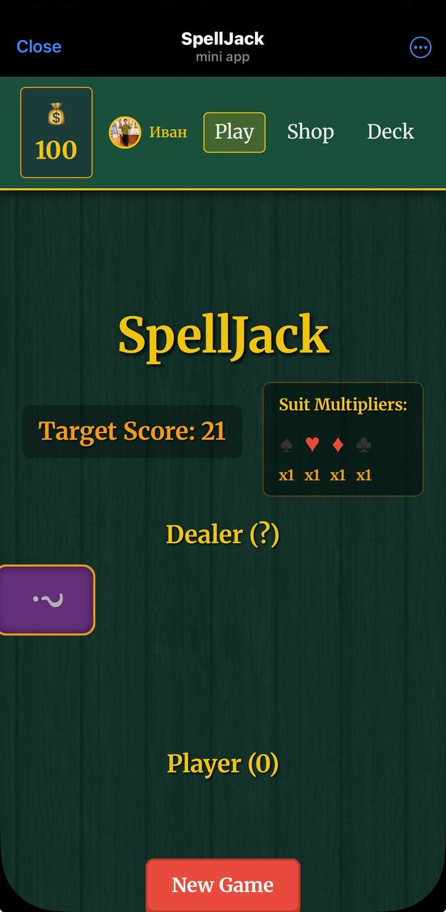

# SpellJack

## Автор: Дедов Иван Андреевич БПИ-234

> Карточная стратегия нового формата - Telegram Mini App

SpellJack - браузерная карточная игра, реализованная как Telegram Mini App. В основе - правила блэкджека, существенно расширенные авторскими механиками: динамическая цель (от 21 до 100 очков), система мультипликаторов мастей и 21 уникальная специальная карта с разными типами активации.

---

## Скриншот стартовой страницы

> 

---

## Список технологий

| Технология               | Роль                                             |
| ------------------------ | ------------------------------------------------ |
| **Vue 3**                | UI-фреймворк, реактивность через Composition API |
| **TypeScript**           | Статическая типизация всего проекта              |
| **Pinia**                | Глобальное хранилище состояния игры              |
| **Vue Router**           | Клиентская маршрутизация (3 экрана)              |
| **Vite**                 | Сборщик и dev-сервер                             |
| **Telegram Web App SDK** | Интеграция с Telegram Mini Apps                  |
| **Vercel**               | Хостинг и деплой                                 |
| **ESLint**               | Статический анализ кода (правила TS + Vue)        |
| **Prettier**             | Автоформатирование кода                          |
| **CSS (custom)**         | Стилизация с кастомными анимациями               |

---

## Памятка по запуску

### Предварительные требования

- Node.js
- npm

### Локальный запуск (без Telegram)

```bash
# Установка зависимостей
npm install

# Запуск dev-сервера
npm run dev
```

Откройте `http://localhost:5173` в браузере. Все игровые функции работают в обычном браузере без Telegram.

### Production-сборка

```bash
npm run build
npm run preview
```

### Линтинг и форматирование

```bash
# Проверить код на ошибки
npm run lint

# Исправить автоисправляемые ошибки
npm run lint:fix

# Отформатировать весь код по Prettier
npm run format
```

### Деплой на Vercel

1. Загрузите репозиторий на GitHub
2. Зайдите на [vercel.com](https://vercel.com) --> **Add New Project**
3. Выберите репозиторий (Vite определяется автоматически, но там пришлось директорию и ветку настраивать по особенному из-за строения репозитория)
4. Настройте деплой (я уже сделал это сам, используя свой, можно пройти зайти в TG Mini App через бота и играть)

> В файле `vercel.json` уже настроены `rewrites` для SPA-роутинга - прямые переходы по URL не дадут 404.

### Запуск как Telegram Mini App

1. Создайте бота через [@BotFather](https://t.me/BotFather) командой `/newbot`
2. Выполните `/newapp` --> укажите URL задеплоенного приложения на Vercel
3. Откройте Mini App через кнопку в боте (Всё это я тоже сделал, можно просто зайти и играть по ссылке `@spelljack_bot`)

---

## Основные особенности

- **21 уникальная специальная карта** с различными эффектами
- **3 типа активации:** ручная (`manual`), пассивная (`passive`)
- **Динамическая цель** - каждую партию генерируется случайное значение от 21 до 100
- **Система мультипликаторов мастей** - перед каждой игрой каждой масти назначается случайный коэффициент от 1.0 до 4.0
- **Прогрессивная экономика** - монеты за победы, магазин карт, личная коллекция
- **Редактор колоды** - стратегический подбор состава перед партией
- **Telegram интеграция** - тактильная обратная связь, данные пользователя, нативный UX

---

## Игровые механики

### Полный список специальных карт (21 карта)

#### Ручная активация (Manual) 🖱️

Активируются игроком вручную в любой момент хода.

- **👁️ Открытый взгляд** (60💰) - Позволяет увидеть скрытую карту дилера
- **⚡ Двойной удар** (70💰) - Удваивает очки следующей вытянутой карты
- **🕳️ Карта-ловушка** (85💰) - Заставляет дилера взять дополнительную карту
- **🔄 Обмен удачи** (75💰) - Обменивает одну карту из руки на верхнюю из колоды
- **💥 Сброс напряжения** (95💰) - Сбрасывает все карты и даёт две новые
- **🔍 Критический выбор** (100💰) - Показывает три верхних карты колоды; игрок выбирает одну
- **🗺️ Картограф** (65💰) - Показывает масть следующей карты в колоде
- **🍃 Листопад** (60💰) - Сбрасывает случайную карту из руки и даёт +3 монеты
- **🔮 Карта предвидения** (70💰) - Показывает следующие 2 карты в колоде
- **⚖️ Стабилизатор** (75💰) - Устанавливает все мастевые коэффициенты на 1.0
- **✨ Золотое касание** (60💰) - Следующая карта даёт монеты, равные добавленным очкам
- **⏰ Хронометр** (80💰) - Следующие 2 карты дают половину очков (округление вниз)
- **🧲 Магнит мастей** (85💰) - Выбранная масть получает +1 к коэффициенту
- **🎯 Карта судьбы** (60💰) - Показывает предсказанный счёт при взятии следующей карты

#### Пассивная активация (Passive) ⚡

Срабатывают автоматически при наступлении определённого условия.

- **🛡️ Щит перегруза** (80💰) - При переборе сбрасывает последнюю взятую карту и продолжает игру
- **🛡️ Тузовая броня** (70💰) - Дополнительная защита: туз может «сложиться» в 1 очко дважды
- **💰 Двойная ставка** (85💰) - Удваивает монетную награду за победу в партии
- **🔥 Огненный туз** (50💰) - Все тузы считаются за 12 очков вместо 11
- **🍀 Счастливая семёрка** (55💰) - При вытягивании карты «7» - +7 монет
- **🌟 Масть удачи** (95💰) - В начале партии удваивает коэффициент случайной масти
- **👑 Королевский указ** (75💰) - Все карты в партии дают +2 очка

### Типы активации

- **Manual (🖱️)** - активируются игроком вручную с панели специальных карт
- **Passive (⚡)** - активируются автоматически при старте игры или наступлении условия

---

## Архитектура

Проект построен с использованием **Composition API** и паттерна **composables** (**Composables Pattern**) - принципу, при котором вся бизнес-логика выносится в переиспользуемые composable-функции, а компоненты остаются тонкими и отвечают только за отображение.

```md
MainGame.vue оркестратор
|
|-- useGameLoop.ts старт партии, Hit, Stand, ход дилера
|-- useSpecialCardActions.ts обработчики 21 специальной карты
|-- useCardScoring.ts подсчёт очков и бонусов
|-- useDeckBuilder.ts создание и перемешивание колод
```

---

## Структура проекта

```md
src/
|-- components/
| |-- MainGame.vue # Оркестратор игры (шаблон + склейка composables)
| |-- Shop.vue # Магазин карт
| |-- DeckEditor.vue # Редактор колоды
| |-- AppHeader.vue # Навигация с монетами
| |-- PlayerHand.vue # Рука игрока с бонус-индикаторами
| |-- DealerHand.vue # Рука дилера
| |-- GameControls.vue # Кнопки управления
| |-- CardModal.vue # Модальное окно информации о карте
| |-- ActualDeckControl.vue # Просмотр текущей колоды
| |-- SpecialCardsPanel.vue # Панель специальных карт
|-- composables/
| |-- useGameLoop.ts # Игровой цикл: старт, Hit, Stand, ход дилера
| |-- useSpecialCardActions.ts # Обработчики всех 21 специальных карт
| |-- useCardScoring.ts # Подсчёт очков и бонусов
| |-- useDeckBuilder.ts # Создание и перемешивание колод
| |-- useTelegram.ts # Telegram Web App интеграция
|-- stores/
| |-- game.ts # Pinia store: всё глобальное состояние игры
|-- data/
| |-- specialCards.ts # Конфигурация 21 специальной карты
|-- router/
| |-- index.ts # Маршруты: /, /shop, /deck-editor
|-- types/
| |-- index.ts # TypeScript-интерфейсы: Card, SpecialCard, ActiveEffects…
|-- App.vue # Корневой компонент
|-- main.ts # Точка входа + инициализация Telegram SDK
|-- style.css # Глобальные стили и CSS-анимации
```

---

## Vue 3 vs React - ключевые отличия

| Аспект                 | Vue 3 (данный проект)           | React (аналогичный подход)         |
| ---------------------- | ------------------------------- | ---------------------------------- |
| Шаблоны                | HTML-based (`<template>`)       | JSX (JS + HTML в одном файле)      |
| Реактивность           | Встроенная (`ref`, `reactive`)  | Обновление через state и re-render |
| Стейт-менеджмент       | Pinia (официальный)             | Redux / Zustand / MobX             |
| Роутинг                | Vue Router (официальный)        | React Router (сторонний)           |
| Компонентный синтаксис | Single File Components (`.vue`) | JS/TS components                   |
| Директивы              | `v-if`, `v-for`, `v-model`      | Условный рендеринг через JS        |
| Composables            | `useXxx()` (Composition API)    | Custom Hooks (`useXxx`)            |

---

## Telegram Mini App функции

- **Данные пользователя** - имя и аватар из `WebApp.initDataUnsafe.user`
- **Тактильная обратная связь** - вибрация при победе (`success`), проигрыше (`error`), подсказке (`warning`)
- **Нативный UX** - `WebApp.expand()` открывает приложение на полный экран
- **Кроссплатформенность** - работает на iOS, Android и в Telegram Web

---

## Статистика проекта

- 21 специальная карта с уникальными эффектами
- 10 Vue-компонентов
- 5 composables (4 игровых + 1 интеграционный)
- 20+ активных эффектов одновременно
- 3 игровых экрана
- 0 TypeScript-ошибок (`vue-tsc --noEmit`)
